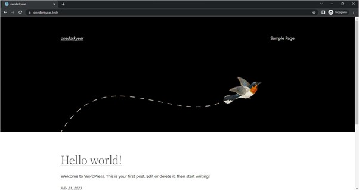
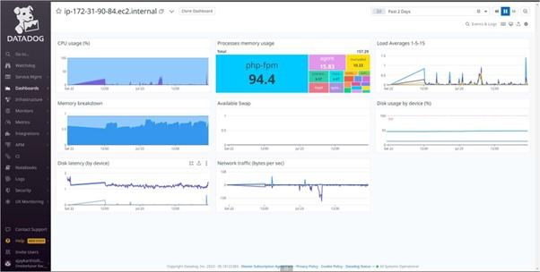
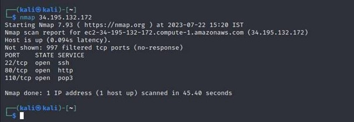
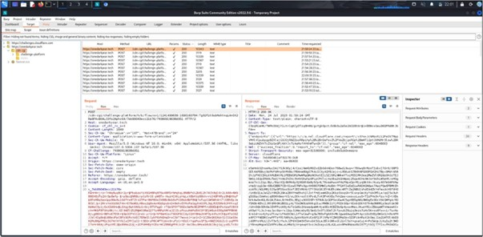
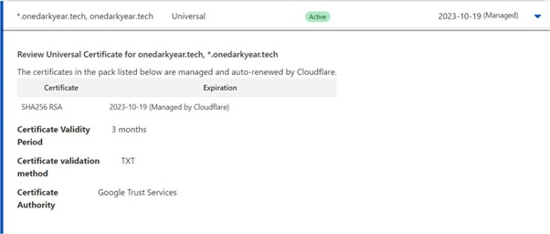

# Cloud-Security
<h1>Cloud Security Project: Secure Web Application Hosting on AWS</h1>

<h2>Overview</h2>
 The main objective was to host a secure web application using a cloud platform (AWS) with a focus on security implementations. I deployed a WordPress blog website (onedarkyear.tech) using AWS EC2 instances and applied various security features, including AWS security tools and WordPress plugins, to safeguard the application against potential threats. This project also includes comprehensive vulnerability assessments and risk mitigation strategies to ensure the highest level of security.
 

<h2>Project Features</h2>
<h3> Cloud Infrastructure (AWS)</h3>
<h4>AWS EC2 (Elastic Compute Cloud): </h4>
The project was hosted using Amazon EC2, with a t2.micro instance running Amazon Linux.
<h4>AWS Security Features: </h4>

<h5>AWS WAF (Web Application Firewall): </h5> 
Used to protect the web application from common web exploits by setting up custom rules.

<h5>AWS CloudWatch:</h5>
Implemented to monitor the health and performance of the instance, including alarms for high network traffic.

<h5>AWS EFS (Elastic File System):</h5>
Integrated for scalable storage with backup capabilities.

<h5>Elastic IP:</h5>
Assigned an Elastic IP address for public access to the instance.

<h3>Web Application (WordPress)</h3>
<h5>WordPress Installation:</h5>
Deployed WordPress on the EC2 instance using the LAMP (Linux, Apache, MySQL, PHP) stack.

<h5>HTTPS/SSL:</h5>
Configured HTTPS using self-signed certificates and later upgraded to a CA-signed certificate via Cloudflare.

<h5>Two-Factor Authentication (2FA):</h5>
Implemented using the WordFence plugin for enhanced login security.

<h3>Security Features</h3>
<h5>Cloudflare Integration:</h5>
Configured Cloudflare for DNS management, SSL/TLS encryption (v1.3), and DDoS protection.

<h4>WordPress Security Plugins:</h4>
<h5>WordFence:</h5>
Enabled 2FA, performed real-time traffic analysis, and added firewall protection.

<h5>Sucuri Security:</h5>
Monitored file integrity, user activity, and login attempts.

<h5>Jetpack:</h5> 
Used for brute-force attack protection and login attempt monitoring.

<h5>Security Hardening:</h5>
Applied security configurations such as strong password policies, session timeout, and TLS enforcement.

<h2>Setup Instructions</h2>
<h3>Prerequisites</h3>
• An AWS account with EC2 access. 
• A domain name (optional; used Get.tech for this project). 
• Basic knowledge of Linux command line and WordPress. 

<h3>Steps to Replicate</h3>

<h4>1. Create an AWS EC2 Instance:</h4>
• Select Amazon Linux 2023 AMI and use the t2.micro instance type. 
• Configure network settings to allow SSH, HTTP, HTTPS traffic from anywhere. 
• Allocate an Elastic IP and associate it with the instance.<be>

<h4>2. Install LAMP Stack:</h4>
<h5> • Update the instance and install the Apache web server, PHP, and MariaDB.</h5>
  sudo yum update -y  
  sudo yum install httpd php mariadb-server -y  

<h5>• Start and enable Apache and MariaDB </h5>
  sudo systemctl start httpd  
  sudo systemctl enable httpd  
  sudo systemctl start mariadb  
  sudo systemctl enable mariadb  

<h4>3. Secure MariaDB:</h4>
<h5>• Run the secure installation script</h5>
  sudo mysql_secure_installation <be>

<h4>4. Install and Configure WordPress:</h3>
• Download and configure WordPress by setting up a database in MariaDB and editing the wp-config.php file.  
• Install necessary PHP extensions and libraries.  

<h4>5. Configure HTTPS and TLS:</h4>
• Install SSL using OpenSSL and set up a self-signed certificate.
• Later, configure Cloudflare for DNS management and obtain a CA-signed certificate for HTTPS.

<h4>6. Implement Security Plugins:</h4>
<h5>• Install and configure the following WordPress plugins for security:</h5>
      • WordFence for 2FA and real-time monitoring.  
      • Sucuri Security for file integrity monitoring.  
      • Jetpack for brute-force protection.  
      
 <h4>7. Monitoring and Logging:</h4>
• Set up AWS CloudWatch for instance health monitoring.  
• Use Datadog for additional instance health insights.  

<h2> Vulnerability Testing </h2> 
To ensure the security of the web application, multiple vulnerability testing tools were used:

<h4>OWASP ZAP:</h4>
• Performed static and dynamic vulnerability scanning of the WordPress website.
• Generated reports showing no high or critical vulnerabilities.

<h4>Nessus:</h4>
• Used advanced scan options to detect 20 medium-risk vulnerabilities related to SSL and outdated software, which were mitigated by updating SSL and server packages.

<h4>Burp Suite:</h4>
• Assessed the attack surface of the web application, checking for input validation and authentication weaknesses.

<h4>Nmap:</h4>
• Scanned open ports and checked for unnecessary services running on the server.

<h4>WPScan:</h4>
• Specifically focused on WordPress vulnerabilities, revealing initial security risks that were resolved with plugin updates and secure configurations. 

<h2> Findings and Risk Mitigation</h2>

| **Threat**           | **Vulnerability**            | **Mitigation Technique**                             | **Tools Used**         |
|----------------------|------------------------------|------------------------------------------------------|------------------------|
| Unauthorized Access  | Weak password policies        | Enforced strong password policies and 2FA             | WordFence, AWS Cognito |
| Brute Force Attack   | Repeated login attempts       | Implemented captcha and account lockout policies      | Jetpack, AWS WAF       |
| Data Theft           | Lack of secure communication  | Enabled HTTPS with a CA-signed certificate            | Cloudflare             |
| DDoS Attack          | Resource overload             | Deployed AWS WAF and Elastic Load Balancer            | AWS WAF, Cloudflare    |

<h2> Challenges and Limitations</h2>

<h4>1. Plugin Conflicts:</h4>
Implementing multiple security plugins caused conflicts, breaking some WordPress functionality, which required troubleshooting.

<h4>2. AWS Limitations:</h4>
AWS student accounts had restrictions, such as no IAM user creation, which limited some automation features.

<h4>3. Vulnerability Fixes:</h4>
Fixing issues like X-Content-Type-Options and X-Frame-Options required custom configurations in the Apache settings.

<h2>Conclusion</h2>
This project provided valuable experience in deploying a secure web application on AWS and integrating various security tools to mitigate risks. By following cloud security best practices and leveraging tools like AWS WAF, Cloudflare, and WordPress plugins, I successfully hardened the website against common web threats. This project highlights my ability to plan, deploy, and secure cloud-based applications in real-world scenarios.

<h2> Technologies and Tools </h2>

<h4>Cloud Platform:</h4>
AWS EC2, AWS WAF, AWS CloudWatch, AWS EFS, Cloudflare

<h4>Web Application:</h4>
WordPress (with LAMP stack)

<h4>Security Tools: </h4>
OWASP ZAP, Nessus, Burp Suite, Nmap, WPScan, WordFence, Sucuri Security, Jetpack

<h4>Testing Tools: </h4>
UpGuard, Pentest-Tools, ImmuniWeb

<h2>Appendix</h2>
## Project Screenshots

### 1. EC2 Instance Setup
]

### 2. WordPress Installation

### 3. AWS CloudWatch Setup

### 4. Datadog

### 5. Nmap advance scan

### 6. Nmap

### 7. Owasp Zap

### 8. Wpscan

### 9. BurpSuite

### 10. Overview of Cloud Flare

### 11. Rules Cloud Flare

### 12. Cloud Flare Setup

### 13. Configuring Cloud Flare to get a CA-Signed Certificate

### 14. DNS management through Cloud Flare

